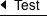
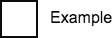
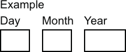
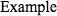
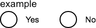
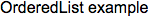
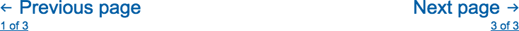
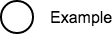
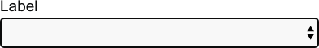
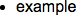

BackLink
========

Prop | Required | Default | Type | Description
:--- | :------- | :------ | :--- | :----------
 `children` | true |  | node | Generally the text that will appear in the back link
 `goBack` |  | undefined | func | A function that is called on click

Breadcrumb
==========

Prop | Required | Default | Type | Description
:--- | :------- | :------ | :--- | :----------
 `children` | true |  | node | Generally a series of anchors or Link components

Button
======

Prop | Required | Default | Type | Description
:--- | :------- | :------ | :--- | :----------
 `children` |  | 'Button' |  | 

Checkbox
========

Prop | Required | Default | Type | Description
:--- | :------- | :------ | :--- | :----------
 `children` | true |  | node | 
 `inline` |  | undefined | bool | 

DateInput
=========

Prop | Required | Default | Type | Description
:--- | :------- | :------ | :--- | :----------
 `children` | true |  | node | 
 `errorText` |  | null | string | 
 `hintText` |  | null | string | 

DocumentFooterMetadata
======================

Prop | Required | Default | Type | Description
:--- | :------- | :------ | :--- | :----------
 `from` |  | undefined | array | 
 `other` |  | undefined | array | 
 `partOf` |  | undefined | array | 

ErrorText
=========

FileUpload
==========

Prop | Required | Default | Type | Description
:--- | :------- | :------ | :--- | :----------
 `acceptedFormats` |  | null | string | 
 `children` | true |  | node | 
 `hint` |  | null | string | 
 `meta` |  | {} | shape[object Object] | 

GridCol
=======

Prop | Required | Default | Type | Description
:--- | :------- | :------ | :--- | :----------
 `children` |  | undefined | node | 

GridRow
=======

Prop | Required | Default | Type | Description
:--- | :------- | :------ | :--- | :----------
 `children` | true |  | node | 

Header
======

Prop | Required | Default | Type | Description
:--- | :------- | :------ | :--- | :----------
 `level` |  | 1 | number | 
 `size` |  | undefined | enumObject.keys(FONT_SIZES) | 

HintText
========

InputField
==========

Prop | Required | Default | Type | Description
:--- | :------- | :------ | :--- | :----------
 `children` | true |  | node | 
 `hint` |  | null | string | 
 `input` |  | {} | shape[object Object] | 
 `meta` |  | {} | shape[object Object] | 

Input
=====

Prop | Required | Default | Type | Description
:--- | :------- | :------ | :--- | :----------
 `onChange` |  | undefined | func | 
 `type` |  | 'text' | string | 
 `value` |  | undefined | string | 

LabelText
=========

Label
=====

Layout
======

Prop | Required | Default | Type | Description
:--- | :------- | :------ | :--- | :----------
 `children` | true |  | node | 

ListItem
========

Prop | Required | Default | Type | Description
:--- | :------- | :------ | :--- | :----------
 `children` | true |  | node | 

ListNavigation
==============

Prop | Required | Default | Type | Description
:--- | :------- | :------ | :--- | :----------
 `children` | true |  | node | 
 `listStyleType` |  | undefined | string | 

MultiChoice
===========

Prop | Required | Default | Type | Description
:--- | :------- | :------ | :--- | :----------
 `children` | true |  | node | 
 `hint` |  | undefined | string | 
 `label` | true |  | node | 
 `meta` |  | {} | shape[object Object] | 

OrderedList
===========

Prop | Required | Default | Type | Description
:--- | :------- | :------ | :--- | :----------
 `children` | true |  | node | 
 `listStyleType` |  | undefined | string | 

Pagination
==========

Prop | Required | Default | Type | Description
:--- | :------- | :------ | :--- | :----------
 `children` | true |  | node | 

Panel
=====

Prop | Required | Default | Type | Description
:--- | :------- | :------ | :--- | :----------
 `panelBody` |  | null | string | 
 `panelTitle` | true |  | string | 

PhaseBadge
==========

PhaseBanner
===========

Prop | Required | Default | Type | Description
:--- | :------- | :------ | :--- | :----------
 `children` | true |  | node | 
 `level` | true |  | string | 

Radio
=====

Prop | Required | Default | Type | Description
:--- | :------- | :------ | :--- | :----------
 `children` | true |  | node | 
 `inline` |  | undefined | bool | 

RelatedItems
============

Prop | Required | Default | Type | Description
:--- | :------- | :------ | :--- | :----------
 `children` | true |  | node | 

SearchBox
=========

Prop | Required | Default | Type | Description
:--- | :------- | :------ | :--- | :----------
 `placeholder` |  | undefined | string | 

Select
======

Prop | Required | Default | Type | Description
:--- | :------- | :------ | :--- | :----------
 `children` | true |  | node | 
 `errorText` |  | null | string | 
 `hint` |  | undefined | string | 
 `input` |  | {} | shape[object Object] | 
 `label` | true |  | string | 
 `meta` |  | {} | shape[object Object] | 

TextArea
========

Prop | Required | Default | Type | Description
:--- | :------- | :------ | :--- | :----------
 `children` | true |  | node | 
 `hint` |  | null | string | 
 `input` |  | {} | shape[object Object] | 
 `meta` |  | {} | shape[object Object] | 

UnorderedList
=============

Prop | Required | Default | Type | Description
:--- | :------- | :------ | :--- | :----------
 `children` | true |  | node | 
 `listStyleType` |  | undefined | string | 

