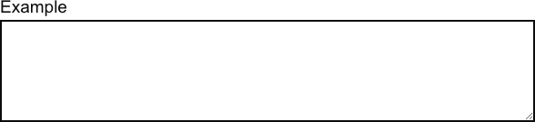

TextArea
========

Prop | Required | Default | Type | Description
:--- | :------- | :------ | :--- | :----------
 `children` | true |  | node | 
 `hint` |  | null | string | 
 `input` |  | {} | shape[object Object] | 
 `meta` |  | {} | shape[object Object] | 

